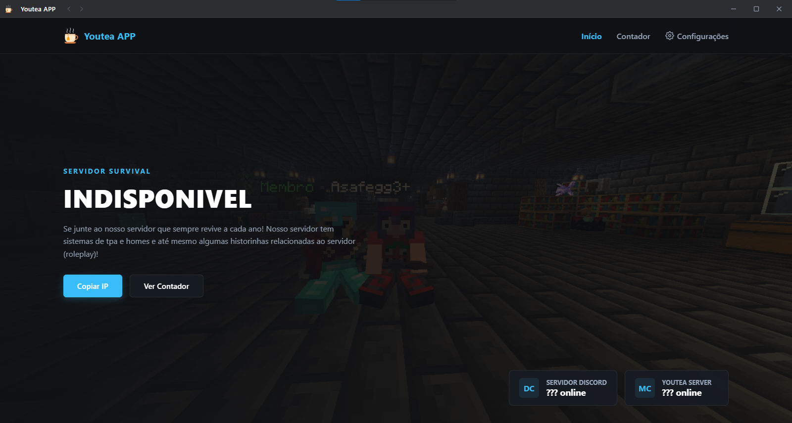
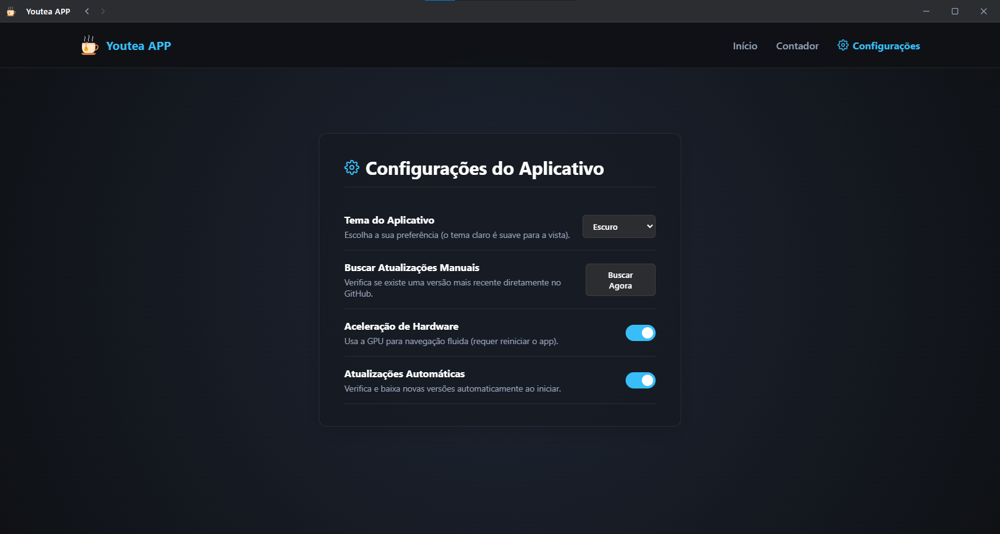

# 🧃 Youtea APP

O aplicativo oficial do **Youtea Server**! Desenvolvido pela equipe Youteam, para trazer novidades e praticidade para os usuarios.

---

## 📸 Screenshots

<div align="center">
  <p><b>Tela Inicial</b></p>
  
  <br><br>
  <p><b>Tela de Configurações</b></p>
  
</div>

---

## ✨ Recursos

* **Barra de Título Customizada:** Visual moderno estilo Discord/Windows 11, totalmente integrado ao app.
* **Contagem Regressiva:** Acompanhe em tempo real o tempo restante para a grande reabertura do servidor.
* **Temas Personalizados:** Alterne facilmente entre o modo **Escuro** e o modo **Claro Suave**.
* **Atualizações Automáticas:** O app avisa e baixa novas versões direto das *Releases* do GitHub.
* **Leve e Otimizado:** Consumo de memória RAM reduzido para rodar tranquilo em segundo plano.

---

## 🚀 Como Rodar o Projeto

Se você quiser testar ou modificar o código no seu computador:

1. **Clone o repositório:**
   ```bash
   git clone [https://github.com/yMathzinhuu/Youtea-Studios.git](https://github.com/yMathzinhuu/Youtea-Studios.git)
   cd Youtea-Studios
